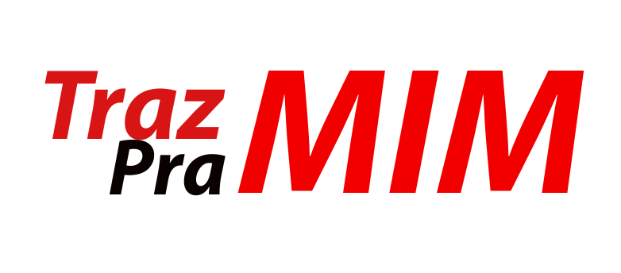
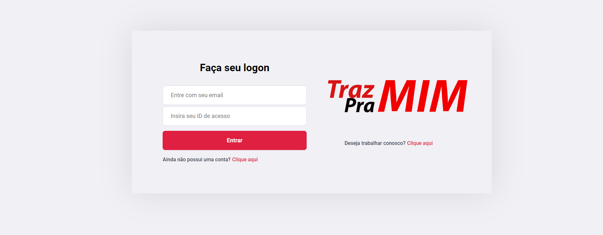

<h1 align="center">
  
</h1>

  <a href="#-tecnologias">Tecnologias</a>&nbsp;&nbsp;&nbsp;|&nbsp;&nbsp;&nbsp;
  <a href="#-projeto">Projeto</a>&nbsp;&nbsp;&nbsp;|&nbsp;&nbsp;&nbsp;
  <a href="#-layout">Layout</a>&nbsp;&nbsp;&nbsp;|&nbsp;&nbsp;&nbsp;

 

  

 

  

 

  Projeto desenvolvido para seleção do pograma de Trainee PADAWANS do Ateliê de Software!

Se deseja conhecer melhor o trabalho do pessoal do Ateliê de Software entre nesse Link: [desse link](https://atelie.software/)

 

## 🚀 Tecnologias

Esse projeto foi desenvolvido com as seguintes tecnologias:

- HTML
- CSS
- JavaScript
- ReactJS
- NodeJS
- Express
- SQLite3

## 💻 Projeto

### Traz Pra Mim

É produto digital voltado para pessoas que desejam adquirir produtos típicos de outras cidades. O Traz pra mim é uma aplicação web que permite adquiri-los de viajantes que
possuem como origem a cidade de onde os produtos são fabricados. Diferente de se sujeitar a preços altos de frete de transportadoras o nosso produto
conecta o comprador com o viajante antes da viagem acontecer, permitindo preços menores.

## 🔖 Layout

Você pode visualizar o layout do projeto clique nesse link: [desse link](https://www.figma.com/file/izjeDnVyT9LRhznqw4WT6b/Untitled?node-id=0%3A1).
